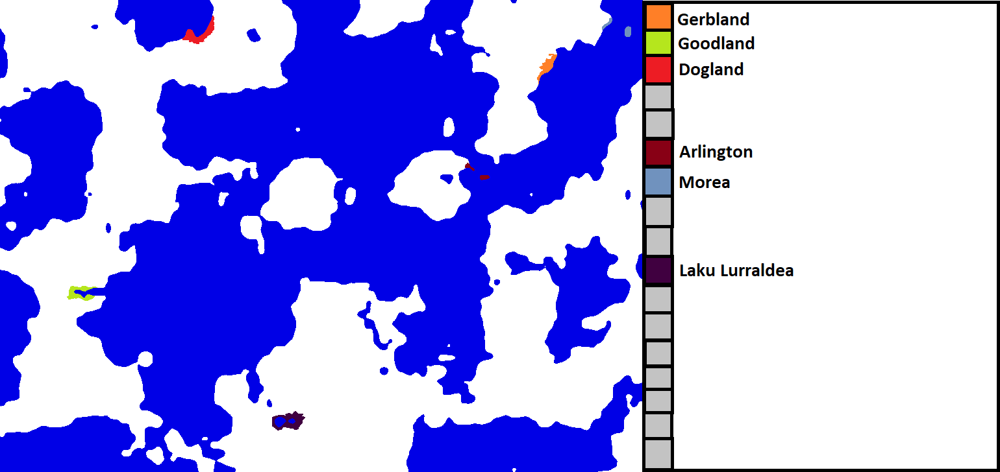

Please join [The Discord](https://discord.gg/q8DEdhR) in order to join this game. Then, DM me with the name of your country and the general area you want to settle. I will accept 21 more players.

#### Turn 2: The Beginning

Dogland - Military, colonize north 
Morea - Science, colonize southwest on mainland 
Arlington - Culture, colonize north-northeast 
Laku Lurraldea - Science, colonize northwest 
Lusciobar - Science 
Goodland - Military, colonize east 
Gerbland - Military, colonize southwest 
Corrædor - Science, northeast

New countries, Lusciobar and Corrædor are founded.

Lusciobar and Corrædor discover Deep Water Navigation, while Laku Lurraldea discovers Improved Agriculture 1.

Obsidian Working reaches Gerbland and Morea.

Statistical Leaders: 
Military: Dogland (6) 
Science: Too many 
Espionage: Morea (2) 
Culture: Arlington (2) 
Size: Gerbland

#### Turn 1: The Beginning

Gerbland - Neutral focus, colonize southwest 
Arlington - Science focus, colonize southeast 
Morea - Espionage focus, colonize northeast-east 
Goodland - Science, colonize east 
Dogland - Military, colonize northeast 
Laku Lurraldea - Neutral, colonize west

Arlington and Goodland both simultaneously discover Obsidian Working. Arlington and Morea expand over the water, while the others expand over land.

Statistical Leaders: 
Military: Dogland (4) 
Science: Arlington and Goodland (2) 
Espionage: Morea (2) 
Culture: Gerbland and Laku Lurraldea (1) 
Size: Dogland

#### Turn 0: Game Starting

Please join [The Discord](https://discord.gg/q8DEdhR) in order to join this game. Then, DM me with the name of your country and the general area you want to settle. I will accept 25 players as well as adding 2-3 'AI' players.

Here is the map:

