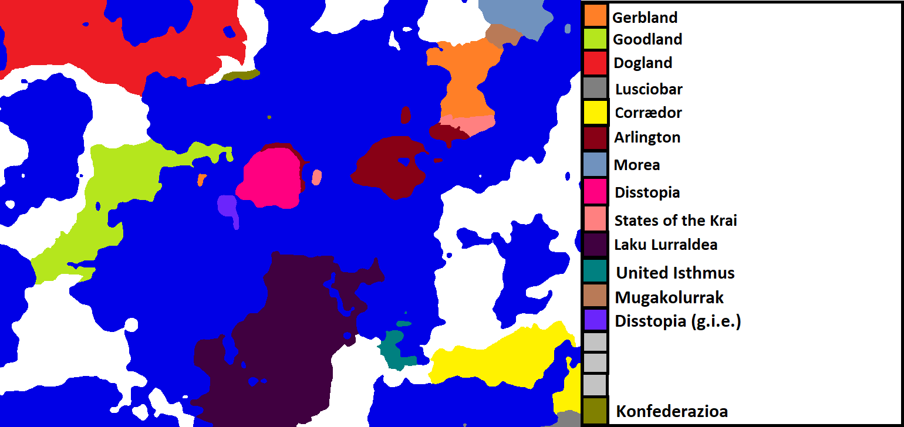
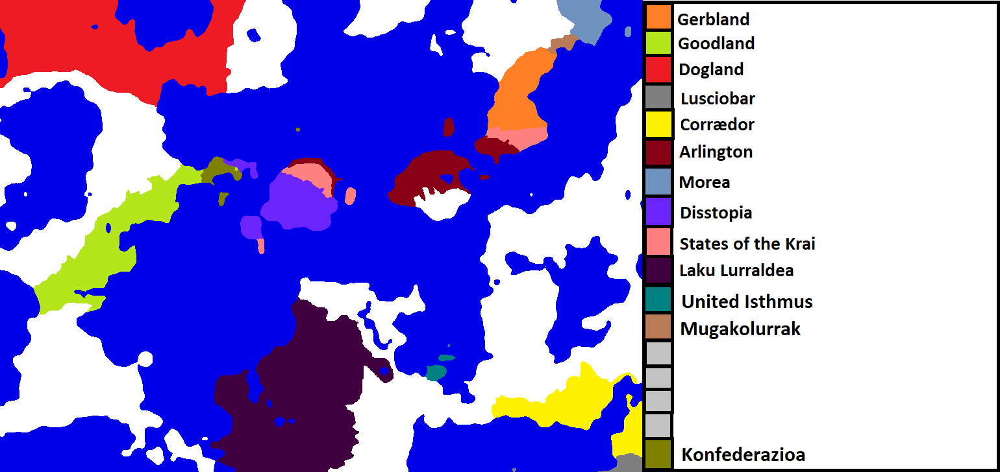
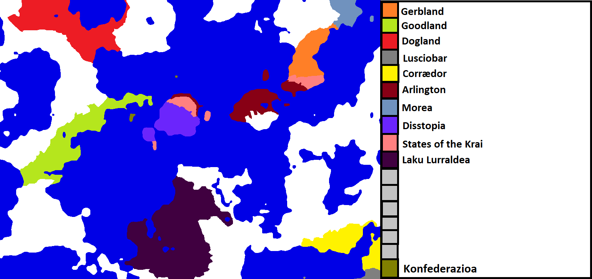
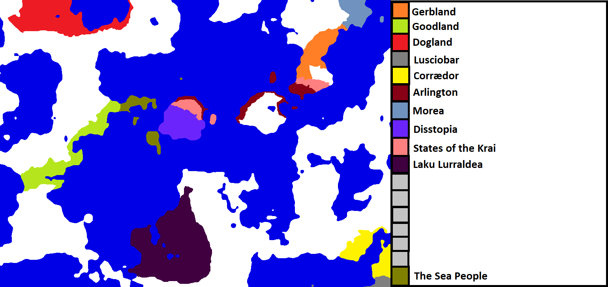
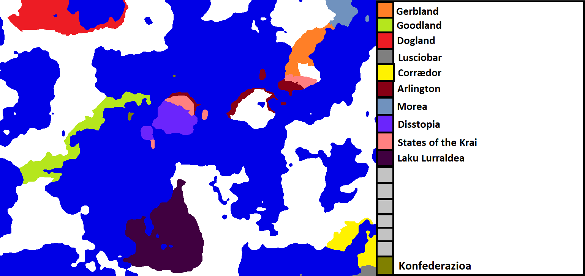
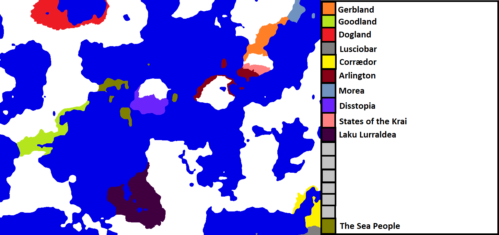
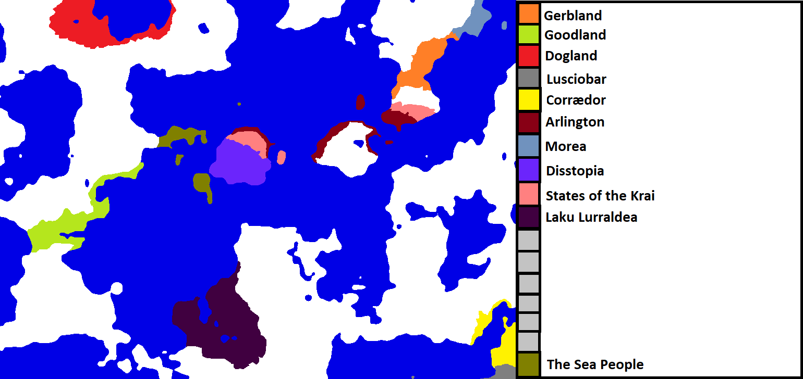
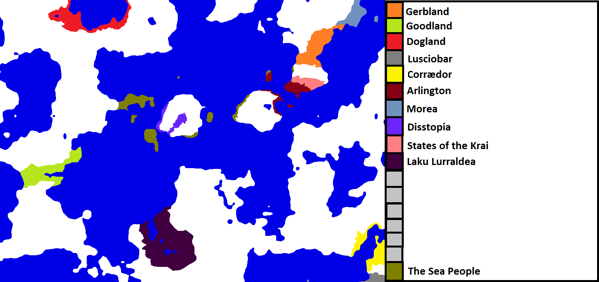
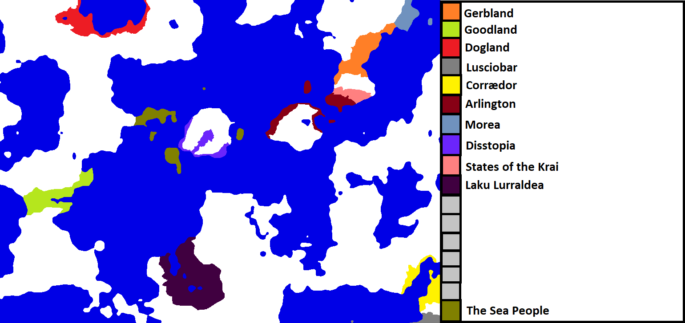

Please join [The Discord](https://discord.gg/q8DEdhR) in order to join this game. Then, DM me with the name of your country and the general area you want to settle. I will accept 19 more players.

## Turn 9: The Obsidian Age

Dogland: Military, colonize east 
Corrædor: Culture, colonize generally 
United Isthmus: Military, colonize SSW 
Goodland: Science, colonize north 
Gerbland: Espionage, colonize generally 
Arlington: Military, colonize south on main island 
Laku Lurraldea: Military, colonize north 
States of the Krai: Neutral 
Morea: Espionage, colonize west 
Mugalokurrak: Neutral, colonize WNW 
Disstopia (g.i.e.): Neutral, DSIT 
Lusciobar: Neutral, DSIT 
Konfederazioa: Military, colonize north

Goodland discovers The Empire.
  
## Turn 8: The Obsidian Age Wars

Corrædor: Espionage, colonize west 
Gerbland: Military, change to Kingdom 
Goodland: Military, invade peninsula from the west 
Dogland: Science, colonize west 
Arlington: Military 
Laku Lurraldea: Neutral, change to Kingdom 
Morea: Military, create Mugakolurrak 
States of the Krai: Espionage 
Arlington, States of the Krai: Invade Disstopia 
Mugakolurrak: Culture 
United Isthmus: Science, colonize northeast 
Disstopia: Military, invade Goodland 
Lusciobar: Neutral (DSIT)

Dogland discovers Improved Agriculture 1.

Morea and Gerbland make peace, creating a buffer state called Mugakolurrak.

### [Second War of the Seas](wars/war8.md)
             

## Turn 7: The Obsidian Age Wars

Corrædor: Science, colonize southwest 
Gerbland: Military, colonize east 
Disstopia: Military, Invade northwest into Goodland 
Goodland: Neutral, colonize west 
Arlington: Culture, colonize the main island 
States of the Krai: Espionage, colonize the mainland in northeast 
Morea: Military, Invade Gerbland 
Laku Lurraldea: Neutral, colonize east 
Lusciobar: Neutral (DSIT) 
Dogland: Military, colonize south

Corrædor discovers The Kingdom. (everyone can now use this)

### [The Peninsular War](wars/war6.md)
### [Second Gerbland-Morea War](wars/war7.md)
             

Stat. Leaders 
Military: Dogland (11) 
Science: Dogland, Corrædor (4) 
Espionage: Morea (10) 
Culture: Corrædor (4) 
Size: Laku Lurraldea
          
## Turn 6: The Obsidian Age Wars

Gerbland: Culture, colonize southwest 
Goodland: Neutral, colonize north 
Corrædor: Military, colonize west 
Dogland: Military, colonize west 
Disstopia: Military, Invade southwest 
Arlington + States of The Krai: Help invade island 
Arlington: Espionage 
States of The Krai: Espionage 
Laku Lurraldea: Neutral, colonize generally 
Morea: Espionage, colonize west 
Lusciobar: Neutral (didn't submit by deadline)

The Sea People invade Goodland as Arlington, SotK, and Disstopia invade them.
### [Final War of the Sea People](wars/war5.md)
            

Stat. Leaders: 
Military: Dogland (9) 
Science: Dogland (4) 
Espionage: Morea (10) 
Culture: Corrædor (4) 
Size: Laku Lurraldea
             
## Turn 5: The Stone Age Wars

Dogland: Military, colonize west 
Gerbland: Culture, Invade Morea 
Goodland: Neutral, colonize north 
Corrædor: Military, colonize south 
Morea: Espionage, sneak invasion 
Arlington, States of the Krai: Invade the Disstopian island 
Arlington: Military 
States of the Krai: Espionage 
Laku Lurraldea: Neutral, colonize generally 
Disstopia: Neutral, colonize generally 
Lusciobar: Espionage, colonize north

### [Gerbland-Morea War](wars/war3.md)
### [Arlington-Disstopia War](wars/war4.md)
       
       

The island is partitioned between Arlington, the States of the Krai, and Disstopia.

Disstopia discovers Obsidian Working.

## Turn 4: The Stone Age Wars

Disstopia: Neutral, invade Sea People holdings on the island 
Dogland: Science, colonize west 
Arlington: Military, invade sea people holdings 
Gerbland: Military, invade sea people colony 
Corrædor: Culture, colonize south 
Lusciobar: Espionage, expand east 
Goodland: Military, colonize west 
Laku Lurraldea: Culture, colonize generally 
Morea: Espionage, invade Gerbland 
States of the Krai: Espionage

Arlington creates the States of the Krai as a buffer state between them and Gerbland. Gerbland, Arlington and the States of the Krai sign an anti- Sea People alliance.

### [War of the Seas](wars/war2.md)
       
       

Statistical Leaders:
Military: Gerbland, Arlington, Goodland, Dogland (7) 
Science: Dogland (4) 
Espionage: Morea (6) 
Culture: Corrædor (4) 
Size: Gerbland / Laku Lurraldea (if lakes are included)

## Turn 3: The Stone Age Wars

Gerbland: Science, colonize southwest 
Arlington: Military, colonize to island in northwest 
Disstopia: Neutral, colonize southwest 
Goodland: Culture, colonize north 
Corrædor: Culture, colonize east 
Laku Larraldea: Neutral, colonize generally 
Dogland: Science, colonize west 
Morea: Espionage, colonize southwest 
Lusciobar: Espionage, colonize east

A new country is founded: Disstopia.

Dogland discovers Obsidian Working.

As Disstopia and Arlington expand, they discover a new seaborne force occupying the coasts of several islands.

The Sea People invade Disstopia.

### [Sea People invasion of Disstopia](wars/war1.md)
            

Disstopia wins handily, pushing the Sea People out of their island (mostly)

Naval skirmishes happen between Arlington and The Sea People.

Statistical Leaders: 
Military: Dogland (7) 
Science: No clear leader 
Espionage: Morea (4) 
Culture: Corrædor, Arlington, Goodland (2) 
Size: Gerbland

## Turn 2: The Beginning

Dogland - Military, colonize north 
Morea - Science, colonize southwest on mainland 
Arlington - Culture, colonize north-northeast 
Laku Lurraldea - Science, colonize northwest 
Lusciobar - Science 
Goodland - Military, colonize east 
Gerbland - Military, colonize southwest 
Corrædor - Science, northeast

New countries, Lusciobar and Corrædor are founded.

Lusciobar and Corrædor discover Improved Sailing, while Laku Lurraldea discovers Improved Agriculture 1.

Obsidian Working reaches Gerbland and Morea.

Statistical Leaders: 
Military: Dogland (6) 
Science: Too many 
Espionage: Morea (2) 
Culture: Arlington (2) 
Size: Gerbland

## Turn 1: The Beginning

Gerbland - Neutral focus, colonize southwest 
Arlington - Science focus, colonize southeast 
Morea - Espionage focus, colonize northeast-east 
Goodland - Science, colonize east 
Dogland - Military, colonize northeast 
Laku Lurraldea - Neutral, colonize west

Arlington and Goodland both simultaneously discover Obsidian Working. Arlington and Morea expand over the water, while the others expand over land.

Statistical Leaders: 
Military: Dogland (4) 
Science: Arlington and Goodland (2) 
Espionage: Morea (2) 
Culture: Gerbland and Laku Lurraldea (1) 
Size: Dogland

## Turn 0: Game Starting

Please join [The Discord](https://discord.gg/q8DEdhR) in order to join this game. Then, DM me with the name of your country and the general area you want to settle. I will accept 25 players as well as adding 2-3 'AI' players.

Here is the map:

