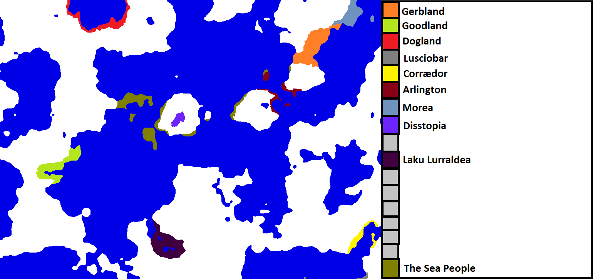
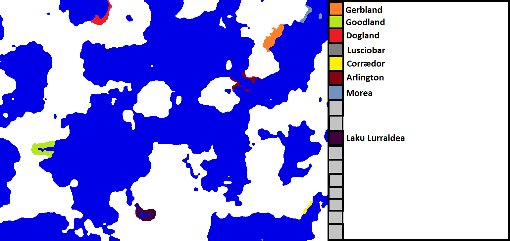

Please join [The Discord](https://discord.gg/q8DEdhR) in order to join this game. Then, DM me with the name of your country and the general area you want to settle. I will accept 20 more players.

## Turn 3: The Stone Age Wars

Gerbland: Science, colonize southwest 
Arlington: Military, colonize to island in northwest 
Disstopia: Neutral, colonize southwest 
Goodland: Culture, colonize north 
Corrædor: Culture, colonize east 
Laku Larraldea: Neutral, colonize generally 
Dogland: Science, colonize west 
Morea: Espionage, colonize southwest 
Lusciobar: Espionage, colonize east

A new country is founded: Disstopia.

Dogland discovers Obsidian Working.

As Disstopia and Arlington expand, they discover a new seaborne force occupying the coasts of several islands.

The Sea People invade Disstopia.

### [Sea People invasion of Disstopia](wars/war1.md)
      

Disstopia wins handily, pushing the Sea People out of their island (mostly)

Naval skirmishes happen between Arlington and The Sea People.

Statistical Leaders: 
Military: Dogland (7) 
Science: No clear leader 
Espionage: Morea (4) 
Culture: Corrædor, Arlington, Goodland (2) 
Size: Gerbland

## Turn 2: The Beginning

Dogland - Military, colonize north 
Morea - Science, colonize southwest on mainland 
Arlington - Culture, colonize north-northeast 
Laku Lurraldea - Science, colonize northwest 
Lusciobar - Science 
Goodland - Military, colonize east 
Gerbland - Military, colonize southwest 
Corrædor - Science, northeast

New countries, Lusciobar and Corrædor are founded.

Lusciobar and Corrædor discover Improved Sailing, while Laku Lurraldea discovers Improved Agriculture 1.

Obsidian Working reaches Gerbland and Morea.

Statistical Leaders: 
Military: Dogland (6) 
Science: Too many 
Espionage: Morea (2) 
Culture: Arlington (2) 
Size: Gerbland

## Turn 1: The Beginning

Gerbland - Neutral focus, colonize southwest 
Arlington - Science focus, colonize southeast 
Morea - Espionage focus, colonize northeast-east 
Goodland - Science, colonize east 
Dogland - Military, colonize northeast 
Laku Lurraldea - Neutral, colonize west

Arlington and Goodland both simultaneously discover Obsidian Working. Arlington and Morea expand over the water, while the others expand over land.

Statistical Leaders: 
Military: Dogland (4) 
Science: Arlington and Goodland (2) 
Espionage: Morea (2) 
Culture: Gerbland and Laku Lurraldea (1) 
Size: Dogland

## Turn 0: Game Starting

Please join [The Discord](https://discord.gg/q8DEdhR) in order to join this game. Then, DM me with the name of your country and the general area you want to settle. I will accept 25 players as well as adding 2-3 'AI' players.

Here is the map:

